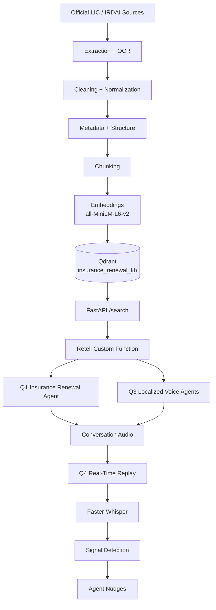

# Insurance Renewal AI System

A connected voice-AI system for insurance renewal conversations. A retrieval-augmented knowledge base built from official LIC and IRDAI sources grounds the voice agents, while a real-time replay analytics prototype analyzes conversation audio and generates explainable agent nudges.

## Overview

| Component | Description | Key technologies |
|---|---|---|
| **Q1** | Retell AI insurance renewal voice agent | Retell AI, GPT-5.6 Terra, Cimo voice, FastAPI |
| **Q2** | RAG knowledge base from official LIC and IRDAI sources | PyMuPDF, pypdf, Tesseract, Sentence Transformers, Qdrant |
| **Q3** | Localized voice prototypes for the Philippines and Indonesia | Retell AI, GPT-5.6 Terra, Cimo voice, Q2 retrieval backend |
| **Q4** | Real-time replay-style conversation analytics | Faster-Whisper, rule-based signal detection |

The four parts are connected: **Q2 is the shared knowledge layer for Q1 and Q3, while Q4 analyzes conversation audio produced by the voice-agent workflows.**

## System Architecture



## End-to-End Flow

1. **Build the knowledge base (Q2).** Official LIC and IRDAI sources are extracted, cleaned, normalized, structured, annotated with metadata, chunked, embedded, and indexed in Qdrant.
2. **Serve retrieval.** A FastAPI backend exposes `/search`. It embeds the incoming query with the same Sentence Transformer model and searches Qdrant for relevant chunks.
3. **Ground the voice agents (Q1, Q3).** When an insurance-specific question requires knowledge-base information, the Retell agent calls `search_knowledge_base`, which sends the query to `/search`. The agent uses the retrieved information or falls back safely when the knowledge base cannot support the answer.
4. **Analyze conversations (Q4).** Conversation audio is replayed at approximately real-time speed, transcribed in chunks, and checked for signals such as price objections, payment difficulty, frustration, compliance risk, human-support requests, renewal intent, and cross-sell opportunities. Qualifying signals can generate agent nudges.

---

## Project Structure

```text
.
├── README.md
├── requirements.txt
├── .gitignore
│
├── Q1_Voice_Agent/
│   ├── app/
│   │   └── main.py
│   └── evidence/
│       ├── recordings/
│       ├── transcripts/
│       └── test_results.md
│
├── Q2_RAG_Knowledge_Base/
│   ├── Data/
│   │   ├── raw/
│   │   │   ├── PDF/
│   │   │   └── WEB/
│   │   └── processed/
│   │       ├── chunks/
│   │       ├── cleaned/
│   │       ├── metadata/
│   │       ├── normalized/
│   │       ├── qdrant/
│   │       ├── raw_text/
│   │       ├── retrieval_tests/
│   │       └── structured/
│   ├── Source_log.xlsx
│   ├── extract_pdfs.py
│   ├── ocr_pdf.py
│   ├── extract_webpages.py
│   ├── cleaned_text.py
│   ├── normalize_text.py
│   ├── metadata.py
│   ├── structure_pages.py
│   ├── structure_webpages.py
│   ├── qc_pages.py
│   ├── validate_extraction.py
│   ├── chunk_pages.py
│   ├── embed_and_index.py
│   ├── retrieve.py
│   └── test_retrieval.py
│
├── Q3_Localized_Voice/
│   ├── Philippines/
│   ├── Indonesia/
│   └── evidence/
│       ├── philippines/
│       ├── indonesia/
│       └── Q3_Evidence.md
│
└── Q4_Real_Time_Analytics/
    ├── app/
    │   ├── realtime_replay.py
    │   └── test_signals.py
    └── evidence/
        ├── latency_report.md
        ├── test_cases/
        │   ├── signal_test_results.md
        │   └── false_positive_analysis.md
        └── transcripts/
            └── q4_demo_terminal_output.txt
```

> `.env` files and credentials are intentionally excluded from version control.

---

## Technology Stack

| Area | Technologies |
|---|---|
| Voice platform | Retell AI, GPT-5.6 Terra, Cimo voice |
| Backend | FastAPI, Uvicorn |
| Vector search | Qdrant Cloud, qdrant-client |
| Embeddings | sentence-transformers, transformers, torch |
| Document processing | PyMuPDF, pypdf, Tesseract OCR / pytesseract, Pillow |
| Web extraction | Requests, BeautifulSoup |
| Speech and analytics | Faster-Whisper, sounddevice, numpy, scipy, scikit-learn |
| Configuration | python-dotenv |
| Tooling | Python 3.10+, Git, ngrok |

---

# Q1 — Insurance Renewal Voice Agent

**Platform:** Retell AI  
**LLM:** GPT-5.6 Terra  
**Voice:** Cimo  
**Language:** English

The agent handles insurance renewal conversations including:

- renewal and premium-payment questions
- available payment channels
- grace-period questions
- lapsed-policy and revival-related information
- product information and FAQs
- customer objections
- incomplete or conflicting information
- out-of-scope questions
- requests for human support

### Retrieval Integration

The Retell agent uses a custom function named `search_knowledge_base`.

```text
Retell AI
   │
   ▼
search_knowledge_base
   │
   ▼
FastAPI /search
   │
   ▼
Sentence Transformer embedding
   │
   ▼
Qdrant insurance_renewal_kb
   │
   ▼
Relevant knowledge chunks
   │
   ▼
Retell AI response
```

### Grounding and Safety

The agent is instructed not to invent:

- premiums
- due dates
- grace periods
- benefits
- eligibility
- revival conditions
- product details
- payment channels
- regulatory information
- contact information

When the knowledge base does not support an answer, the agent uses a safe fallback instead of guessing.

### Evidence

Q1 includes recordings, transcripts, and test results for:

1. Cooperative customer
2. Customer objection
3. Incomplete/conflicting information

Evidence location: `Q1_Voice_Agent/evidence/`

### Limitation

Live human call transfer is not implemented. Human-support requests are handled conversationally.

---

# Q2 — RAG Knowledge Base

## Sources

The knowledge base contains **29 official sources from LIC and IRDAI**:

- 22 PDF documents
- 7 webpages

The complete source inventory is maintained in:

```text
Q2_RAG_Knowledge_Base/Source_log.xlsx
```

No real customer records are included in the corpus.

## Processing Pipeline

| Stage | Approach | Script |
|---|---|---|
| PDF extraction | PyMuPDF / pypdf | `extract_pdfs.py` |
| OCR | Tesseract / pytesseract for scanned PDFs | `ocr_pdf.py` |
| Webpage extraction | Requests + BeautifulSoup | `extract_webpages.py` |
| Cleaning | Removes presentation noise while preserving knowledge-bearing content such as tables, forms, legal clauses, numbers, dates, policy conditions, product information, and contacts | `cleaned_text.py` |
| Normalization | Standardizes extracted text | `normalize_text.py` |
| Metadata | Document and page-level metadata | `metadata.py` |
| Structure | Page/webpage records with provenance | `structure_pages.py`, `structure_webpages.py` |
| Quality control | Extraction and page-level validation | `qc_pages.py`, `validate_extraction.py` |
| Chunking | Token-based, page-preserving chunks | `chunk_pages.py` |
| Embedding/indexing | Sentence Transformer + Qdrant | `embed_and_index.py` |
| Retrieval/evaluation | Query → embedding → Qdrant search | `retrieve.py`, `test_retrieval.py` |

## Metadata and PII Handling

Structured records and chunks retain source/provenance metadata and classifications including:

- source ID
- filename
- title
- authority
- document type
- product
- plan number
- UIN
- version
- effective date
- language
- status
- content type
- PII classification
- table/form indicators
- source URL where applicable

The corpus is classified for PII status, including PII-free content, template fields, public contacts, and possible PII. This makes source provenance and privacy status traceable during retrieval.

## Chunking and Indexing

| Setting | Value |
|---|---|
| Target chunk size | ~200 tokens |
| Overlap | 50 tokens |
| Hard maximum | 220 tokens |
| Page boundaries | Preserved |
| Embedding model | `sentence-transformers/all-MiniLM-L6-v2` |
| Embedding dimension | 384 |
| Vector database | Qdrant |
| Collection | `insurance_renewal_kb` |
| Distance | Cosine similarity |
| Final index size | 3,655 chunks |

## Retrieval Evaluation

Five retrieval questions were tested and **all 5 passed**.

The evaluation results are stored in:

```text
Q2_RAG_Knowledge_Base/Data/processed/retrieval_tests/
```

This is a focused prototype evaluation set rather than a full production retrieval benchmark.

---

# Q3 — Localized Voice Prototypes

Q3 contains localized voice prototypes for the Philippines and Indonesia. Both use Retell AI with GPT-5.6 Terra and the Cimo voice, and both connect to the shared Q2 retrieval backend.

## Philippines — Life Insurance / Insurance Renewal

The prototype supports:

- English
- Filipino/Tagalog
- natural Taglish

The conversation design uses localized phrasing and politeness markers such as `po` and `opo` rather than relying on literal translation.

Tested scenarios include:

- payment interaction
- objection handling
- Taglish/localization

Evidence:

```text
Q3_Localized_Voice/evidence/philippines/
```

## Indonesia — Multifinance / Consumer Finance

The prototype is designed for Bahasa Indonesia with:

- formal and colloquial speech
- Indonesian-English code switching
- finance terminology such as `cicilan`, `angsuran`, `tenor`, `denda`, `DP`, `jatuh tempo`, and `pembiayaan`

The current Q2 corpus does **not** contain a dedicated Indonesia multifinance knowledge base. Therefore, Indonesia-specific questions that cannot be supported by the existing corpus fall back safely rather than being answered from unsupported model knowledge.

Evidence:

```text
Q3_Localized_Voice/evidence/indonesia/
```

A summary of the Q3 evidence is in `Q3_Localized_Voice/evidence/Q3_Evidence.md`.

## Q3 Limitations

- The Indonesia prototype does not yet have a dedicated multifinance corpus.
- A regional Indonesian accent outside standard Jakarta speech was not tested.
- Production-grade multilingual coverage would require a broader localized knowledge base and additional native-speaker evaluation.

---

# Q4 — Real-Time Conversation Analytics

Q4 is a **real-time replay-style prototype**, rather than a production streaming system.

Audio is replayed at approximately real-time speed and processed in chunks so signals can be produced during the conversation rather than only after the call ends.

## Detection Design

| Aspect | Detail |
|---|---|
| Transcription | Faster-Whisper, `base` model |
| Chunk size | Approximately 5 seconds |
| Detection | Primarily deterministic / rule-based |
| Confidence threshold | 0.70 |
| Cooldown | 10 seconds |
| Duplicate suppression | Implemented |

## Detected Signals

- `PRICE_OBJECTION`
- `FRUSTRATION`
- `PAYMENT_DIFFICULTY`
- `RENEWAL_INTENT`
- `HUMAN_SUPPORT`
- `COMPLIANCE_RISK`
- `CROSS_SELL_OPPORTUNITY`

## Testing

The signal test suite passed **4/4 tests**, covering:

- missed cross-sell opportunity
- compliance risk
- rising frustration
- noisy/ambiguous input

A false-positive analysis is included in the evidence folder.

## Latest Replay Measurement

Latest replay:

- Audio duration: **24.02 s**
- Wall-clock time: **24.03 s**
- Generated nudges: **2**
- Suppressed nudges: **0**

| Stage | P50 | P95 |
|---|---:|---:|
| ASR | 1174 ms | 1366 ms |
| Signal detection | 0.06 ms | 0.06 ms |
| Nudge generation | 0.00 ms | 0.36 ms |
| End-to-end | 1174 ms | 1367 ms |

These percentiles are computed from the five chunks in the prototype run. They are prototype measurements, not production-scale benchmarks.

---

# Setup and Installation

## Prerequisites

- Python 3.10+
- Git
- Tesseract OCR
- Qdrant Cloud account/cluster
- Retell AI account
- ngrok

## Install Dependencies

Run from the **repository root**:

```bash
pip install -r requirements.txt
```

## Configure Environment Variables

Create the required local `.env` file(s) with your Qdrant credentials. Never commit credentials.

```env
QDRANT_URL=<your-qdrant-cluster-url>
QDRANT_API_KEY=<your-qdrant-api-key>
```

Retell and ngrok credentials are configured through their respective dashboards/CLI and are not stored in this repository.

---

# Running the Project

Each step below states the directory it should be run from.

## Q2 — Build / Refresh the Knowledge Base

Run from `Q2_RAG_Knowledge_Base/`:

```bash
python embed_and_index.py
```

When rebuilding the knowledge base from raw sources, run the extraction, OCR where required, cleaning, normalization, structuring, chunking, and indexing scripts in their intended order before indexing.

## Q2 — Retrieval Evaluation

Run from `Q2_RAG_Knowledge_Base/`:

```bash
python test_retrieval.py
```

## Q1 — FastAPI Backend

Run from `Q1_Voice_Agent/` (activate the relevant virtual environment first if required):

```bash
uvicorn app.main:app --reload
```

In a second terminal (any directory), expose the local backend:

```bash
ngrok http 8000
```

In the Retell dashboard, point the `search_knowledge_base` custom function at:

```text
<your-current-ngrok-url>/search
```

The ngrok URL is temporary and can change whenever the tunnel is restarted.

## Q4 — Replay Analytics and Signal Tests

Run from `Q4_Real_Time_Analytics/`:

```bash
python app/realtime_replay.py
python app/test_signals.py
```

---

# Evaluation and Evidence

| Area | Result | Evidence |
|---|---|---|
| **Q1** | Cooperative, objection, and incomplete/conflicting scenarios tested | `Q1_Voice_Agent/evidence/` |
| **Q2** | 5/5 retrieval questions passed; 3,655 chunks indexed | `Q2_RAG_Knowledge_Base/Data/processed/retrieval_tests/` |
| **Q3** | Philippines and Indonesia localized prototype evidence | `Q3_Localized_Voice/evidence/` |
| **Q4** | 4/4 signal tests passed; latency measured | `Q4_Real_Time_Analytics/evidence/` |

---

# Reliability and Safety

- **Grounding:** Insurance-specific answers are grounded in retrieved knowledge-base content.
- **Fallback:** Unsupported or out-of-scope questions use a safe fallback rather than fabricated information.
- **Source traceability:** Knowledge records carry source metadata, while `Source_log.xlsx` inventories the 29 sources.
- **Privacy:** The corpus uses public LIC/IRDAI material and does not contain real customer records.
- **Secrets:** Credentials are kept in environment variables and are excluded from version control.
- **Explainability:** Q4 signal detection is primarily rule-based so that trigger conditions can be inspected and tested.

---

# Known Limitations

- **Q1:** Live human call transfer is not implemented; human-support requests are handled conversationally.
- **Q2:** The retrieval evaluation contains only 5 test questions and should be expanded for production.
- **Q3:** The Indonesia prototype does not have a dedicated Indonesia multifinance corpus.
- **Q3:** Indonesian regional accents outside standard Jakarta speech were not tested.
- **Q4:** Speaker diarization is not implemented.
- **Q4:** The current implementation is a chunked replay prototype, not true production streaming ASR.
- **Q4:** Latency figures are based on five chunks and are prototype measurements, not production-scale benchmarks.
- **Deployment:** ngrok is used only for prototyping and should be replaced with a stable, authenticated deployment for production.

---

# Production Improvements

1. Implement real human handoff / warm transfer with a call-routing provider.
2. Add a dedicated Indonesia multifinance knowledge corpus and evaluate regional accents with native speakers.
3. Replace replay-based processing with true streaming ASR and add speaker diarization.
4. Expand the retrieval evaluation set and add automated regression testing.
5. Replace temporary ngrok tunneling with stable, authenticated deployment and monitoring.
6. Validate signal detectors against labelled call data and consider hybrid/learned classifiers where appropriate.
7. Add production observability for retrieval quality, ASR latency, end-to-end latency, fallback rate, and nudge precision/recall.

---

# Final System Summary

This project connects the four assessment questions into one workflow:

```text
Official LIC / IRDAI sources
          │
          ▼
     Q2 RAG pipeline
          │
          ▼
   Qdrant knowledge base
          │
          ▼
 ┌─────────────────────┐
 │ Q1 / Q3 Voice Agents│
 └──────────┬──────────┘
            │
            ▼
     Conversation audio
            │
            ▼
     Q4 Live-style replay
            │
            ▼
      Signals + Nudges
```

The result is a prototype insurance-renewal AI system combining grounded retrieval, voice interaction, localization, and real-time conversation analytics while explicitly documenting its current production limitations.